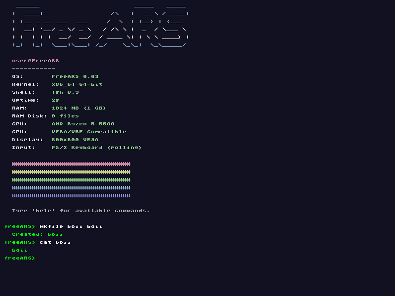

# FreeARS - Another Random System

> *"I'm doing a (free) operating system (just a hobby, won't be big and professional like linux)"*  
> — inspired by Linus Torvalds, 1991

FreeARS is a hobby x86_64 kernel written from scratch. Now with 64-bit mode, Multiboot2, RAM Disk filesystem, and universal framebuffer detection.

**Current version:** 0.03  
**Branch:** `x86_64-legacy` (stable? - MAYBE final.)

---

## Screenshots

*18:40 (6:40 PM) - 28/04/26 — IT BOOTED!!! WORKED ON 64 BIT MODE (QEMU) AFTER A COUPLE HOURS OF BUGS!*

*10:30 - 30/04/26 - IT BOOTED ON A BAREMETAL LIKE VM (VirtualBox)!!! Another win!!*

### VirtualBox Boot + fastfetch + RAM Disk Filesystem

---

## What's new in 0.03

- **Universal framebuffer detection** — tests 6 common addresses
- **Real CPU name** via CPUID (shows "AMD Ryzen 5 5500" etc.)
- **RAM Disk filesystem** — `mkfile`, `cat`, `ls`, `rm` commands
- **Multiboot2 info parsing** — reads tags from GRUB
- Works on **QEMU + VirtualBox** (BIOS/Legacy mode)
- Improved `fastfetch` with real CPU detection

---

## Features

- Multiboot2 (GRUB)
- 64-bit long mode
- VESA framebuffer (800x600x32) with bitmap font
- Universal framebuffer address detection (6 fallback addresses)
- Graphical shell with scroll
- Real CPU name detection via CPUID
- RAM Disk filesystem (`mkfile`, `cat`, `ls`, `rm`)
- Commands: `help`, `clear`, `uname`, `echo`, `sleep`, `memtest`, `pagetest`, `crash`, `ticks`, `fastfetch`, `arpm`
- Dynamic memory allocator (`kmalloc`/`kfree`) — 1 GB heap
- 4-level paging (PML4) — maps 4 GB
- IDT with graphical exception handler (all 32 exceptions)
- PIC 8259 + PIT timer (100 Hz)
- PS/2 Keyboard polling with Shift/Caps Lock
- Custom ASCII art boot screen

---

## What it lacks

- User mode (ring 3)
- Multitasking / Scheduler
- Mouse support
- Networking
- GPU drivers
- Real filesystem (FAT32/ext2)
- Any practical use

---

## Commands

| Command | Description |
|---------|-------------|
| `help` | Show all commands |
| `clear` | Clear screen |
| `uname` | System info |
| `echo <text>` | Print text |
| `sleep <ms>` | Sleep milliseconds |
| `memtest` | Test heap allocator |
| `pagetest` | Test virtual memory |
| `crash` | Test exception handler |
| `ticks` | Show timer ticks |
| `fastfetch` | System info (real CPU name!) |
| `mkfile <n> <c>` | Create file on RAM disk |
| `cat <file>` | Show file content |
| `ls` | List files |
| `rm <file>` | Remove file |
| `arpm list` | List packages |
| `arpm -ci <pkg>` | Install package |

---

## History

| Version | Description |
|---------|-------------|
| 0.01 | First release. 32-bit, VESA, Legacy BIOS |
| 0.02 | 64-bit, Multiboot2, framebuffer, shell |
| 0.03 | Universal FB detection, CPUID, RAM Disk FS, VirtualBox support |
