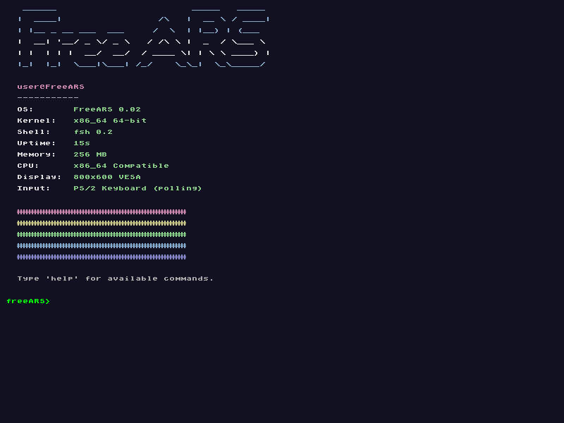

# FreeARS - Another Random System

> *"I'm doing a (free) operating system (just a hobby, won't be big and professional like linux)"*  
> — inspired by Linus Torvalds, 1991

FreeARS is a hobby x86_64 kernel written from scratch. Now with 64-bit mode and Multiboot2 support, aiming to run on modern hardware.

**Current version:** 0.02  
**Branch:** `64bit` (active development)

---

## Screenshots

### fastfetch - First successful 64-bit boot!


*18:40 (6:40 PM) - 28/04/26 — IT BOOTED!!! WORKED ON 64 BIT MODE (QEMU) AFTER A COUPLE HOURS OF BUGS!*

---

## Things added in 64 bit branch 0.02

- **x86_64 (64-bit)** protected mode
- **Multiboot2** support
- 4-level paging (PML4)
- Rewritten from 32-bit codebase
- Targeting modern GPUs (GOP framebuffer)
- All commands ported from 0.01

---

## Features

- Multiboot2 (GRUB)
- 64-bit long mode
- GOP framebuffer (800x600x32) with bitmap font
- Graphical shell with scroll
- Commands: `help`, `clear`, `uname`, `echo`, `sleep`, `memtest`, `pagetest`, `crash`, `ticks`, `fastfetch`, `arpm`
- Dynamic memory allocator (`kmalloc`/`kfree`)
- 4-level paging
- IDT with graphical exception handler
- PIC 8259 + PIT timer (100 Hz)
- PS/2 Keyboard polling with Shift/Caps Lock
- Custom ASCII art boot screen

---

## What it lacks

- Filesystem
- User mode (ring 3)
- Multitasking
- Mouse
- Networking
- GPU drivers
- Any practical use

---

## Hardware

Tested on QEMU. Should work on UEFI hardware with GOP.

```bash
dd if=freeARS.iso of=/dev/sdX bs=1M status=progress
```

Or use [Ventoy](https://ventoy.net). Requires **UEFI boot** (no Legacy BIOS).

---

## Commands

| Command | Description |
|---------|-------------|
| `help` | Show commands |
| `clear` | Clear screen |
| `uname` | System info |
| `echo <text>` | Print text |
| `sleep <ms>` | Sleep |
| `memtest` | Test heap |
| `pagetest` | Test paging |
| `crash` | Test exception handler |
| `ticks` | Timer ticks |
| `fastfetch` | System info |
| `arpm list` | List packages |
| `arpm -ci <pkg>` | Install package |
