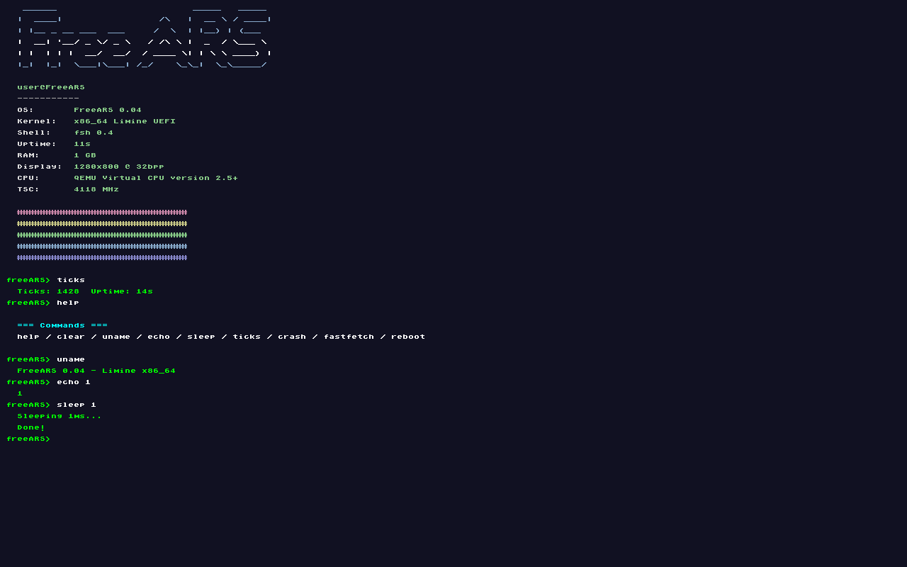
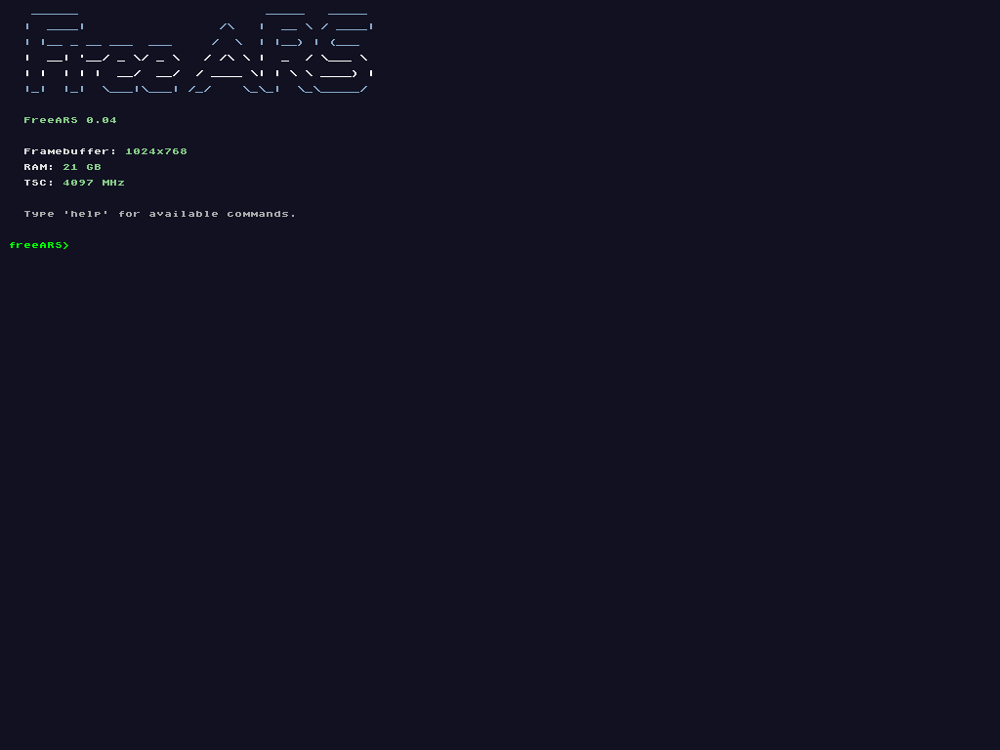

# FreeARS - Another Random System

> *"I'm doing a (free) operating system (just a hobby, won't be big and professional like linux)"*  
> — inspired by Linus Torvalds, 1991

FreeARS is a hobby x86_64 kernel written from scratch. Now featuring **UEFI boot**, **Limine protocol**, and **TSC-based timing**.

**Current version:** 0.04  
**Branch:** `64bit-uefi` (active development)

---

## Screenshots

*28/04/26 — IT BOOTED!!! 64-bit mode (QEMU) after hours of bugs!*

*30/04/26 — Booted on a baremetal-like VM (VirtualBox)!*

*UEFI + Limine + TSC working!!!*

### UEFI Boot + fastfetch + TSC (QEMU)

### UEFI Boot + RAM detection (VirtualBox)

---

## What's new in 0.04

- **UEFI boot** via Limine (no more GRUB/BIOS)
- **TSC (Time Stamp Counter) timing**
- **Tickless operation** (no PIT IRQ scheduler)
- **TSC calibration via PIT**
- **Accurate `sleep_ms()`**
- **Improved uptime tracking**
- **Framebuffer via Limine protocol**
- **Basic RAM detection (Limine memmap)**
- Boots on **QEMU (OVMF)** and partially tested on **VirtualBox**

---

## Features

- **UEFI boot** (Limine)
- x86_64 long mode
- Framebuffer rendering
- Basic graphical shell (8x16 bitmap font)
- **TSC-based timing**
- CPUID CPU name detection
- RAM size detection (usable memory only)
- Basic command shell:
  - `help`, `clear`, `uname`, `echo`
  - `sleep`, `ticks`, `fastfetch`
  - `crash`, `reboot`
- IDT + basic exception handling
- PS/2 keyboard input (polling, Shift/Caps support)
- Custom ASCII boot screen

---

## Performance: PIT vs TSC

| Aspect | PIT (0.03) | TSC (0.04) |
|--------|------------|------------|
| Resolution | ~10ms | ~1ns |
| sleep_ms(1) | ~10-20ms | ~1ms |
| Read cost | High | Very low |
| IRQ usage | Yes | No |
| Jitter | High | Minimal |

---

## What it lacks (still)

- Memory allocator (`kmalloc` / `kfree`)
- User mode (ring 3)
- Multitasking / Scheduler
- Mouse input
- Networking
- GPU drivers
- Filesystem (FAT32/ext2)
- Real-world usability (still a learning project)

---

## Commands

| Command | Description |
|---------|-------------|
| `help` | Show commands |
| `clear` | Clear screen |
| `uname` | System info |
| `echo <text>` | Print text |
| `sleep <ms>` | Sleep using TSC |
| `ticks` | Show uptime |
| `fastfetch` | System overview |
| `crash` | Trigger exception | -- May not work? Not tested yet. -- Yea, fixing it tomorrow maybe? It just reboots.
| `reboot` | Reboot system |

---

## Bootloaders

| Version | Bootloader | Mode | Status |
|---------|-----------|------|--------|
| 0.01 (32bit-unused) | GRUB | BIOS/Legacy | Deprecated |
| 0.02 | GRUB (64bit) (Multiboot2) | BIOS/Legacy | Deprecated |
| 0.03 | GRUB (64bit) (Multiboot2) | BIOS/Legacy | Old stable |
| **0.04** | **(64bit-uefi) Limine** | **UEFI** | **Current** |

---

## Version history

| Version | Description |
|--------|-------------|
| 0.01 | 32-bit, VESA, BIOS |
| 0.02 | 64-bit, Multiboot2, shell |
| 0.03 | FB detection, CPUID, RAM detection |
| **0.04** | **UEFI + Limine, TSC timing, tickless kernel** |

---

## Next steps (0.05)

- [ ] Memory allocator (`kmalloc` / `kfree`)
- [ ] APIC timer
- [ ] Basic scheduler (round-robin)
- [ ] User mode (ring 3)
- [ ] Syscalls
- [ ] FAT32 driver
- [ ] PCI enumeration

---

## Notes

- TSC is calibrated using PIT for better accuracy
- Currently uses busy-wait for sleep (no interrupts yet)
- Designed for learning low-level systems

---

## License

Do whatever you want. It's a hobby.

