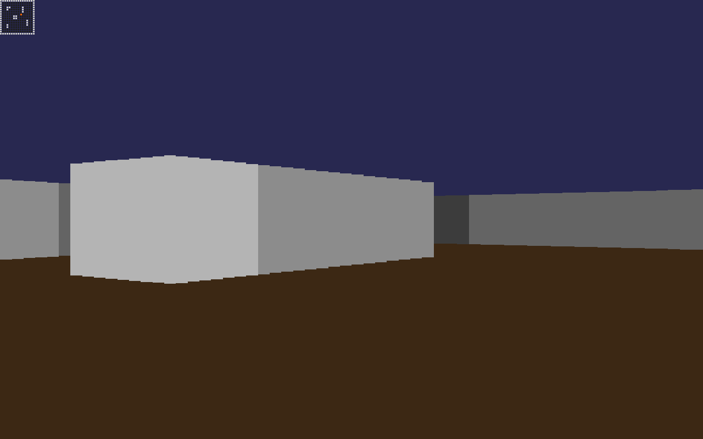
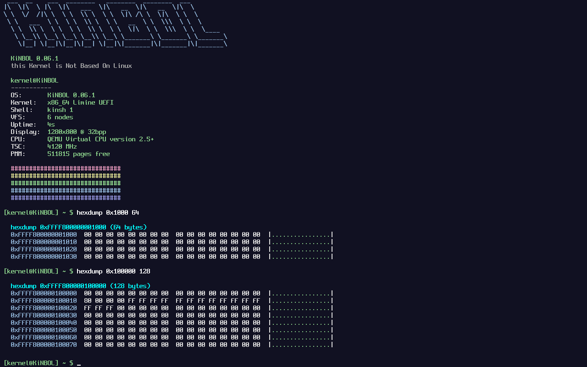
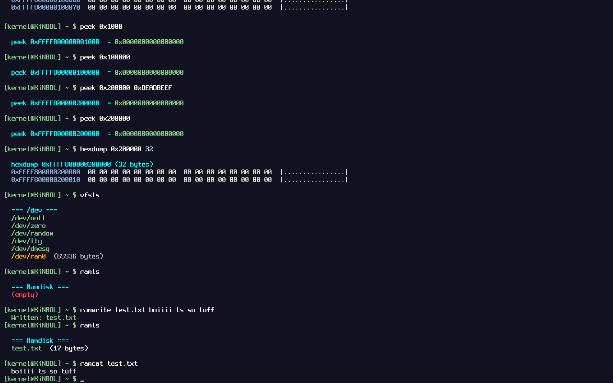

# KiNBOL - this Kernel is Not Based On Linux
> *"I'm doing a (free) operating system (just a hobby, won't be big and professional like linux)"*
> -> inspired by Linus Torvalds, 1991

KiNBOL (formerly FreeARS) is a hobby x86_64 kernel written from scratch.
UEFI boot via Limine, framebuffer output, and a growing low-level system layer.
FreeARS Boot code can still be found!

**Current version:** 0.06.1

**Branch:** `x86_64-uefi` (active development)

---

## Screenshots

*28/04/26 -> IT BOOTED!!! 64-bit mode (QEMU) after hours of bugs!*

*30/04/26 -> Booted on a baremetal-like VM (VirtualBox)!*

*31/04/26 -> UEFI + Limine + TSC working!!!*

*31/04/26 -> Bare metal on real hardware working! Posted on my tiktok. @theloneahlan*

*01/05/26 -> PMM + heap working! Tested up to 32GB RAM.*

*01/05/26 -> Shell + ATA disk detection added.*

*03/05/26 -> VFS, ramdisk, dmesg, heap improvements, new Spleen font!*

*04/05/26 -> Intial software render + Raycast game!*

### KiNBOL 0.06.1 - Raycast!!

### KiNBOL 0.06.1 - Fastfetch and some test!

---

## What's new in 0.06.1

* **Command History** -> Commands are now saved! kb.c.
* **Spleen 8x16 bitmap font** -> much cleaner terminal output
* **VFS (Virtual File System)** -> `/dev/null`, `/dev/zero`, `/dev/random`, `/dev/tty`, `/dev/ram0`
* **Ramdisk** -> in-memory filesystem, create/read/delete files at runtime
* **dmesg** -> kernel ring buffer log (4KB circular), records all boot events
* **Heap improvements** -> `kcalloc`, `krealloc`, magic number corruption detection, bidirectional coalescing, usage statistics
* **Memory debug tools** -> `hexdump`, `peek`, `poke` with automatic physical→virtual address conversion
* **`calc`** -> expression calculator with correct precedence, hex support, bitwise operators
* **`meminfo`** -> detailed memory map + heap statistics
* **`ascii`** -> ASCII table
* **Blinking cursor** in the terminal (callback-based, keyboard driver integrated)
* **RTC driver** -> `date` command shows real time

---

## Features

* UEFI boot via Limine
* x86_64 long mode kernel
* Framebuffer terminal with **Spleen 8x16** bitmap font
* PS/2 keyboard input with blinking cursor
* TSC-based timing (calibrated via PIT)
* CPUID CPU detection
* RAM detection via Limine memmap
* IDT + exception handling
* Serial debug output
* Physical Memory Manager (PMM) -> bitmap allocator
* Heap allocator with corruption detection and coalescing
* Virtual File System (VFS) with device nodes
* In-memory ramdisk (RAM-backed file storage)
* Kernel log ring buffer (dmesg)
* RTC real-time clock driver

---

## Shell commands

| Command                    | Description                              |
| -------------------------- | ---------------------------------------- |
| `help`                     | Show available commands                  |
| `clear`                    | Clear screen                             |
| `uname`                    | Kernel version info                      |
| `echo <text>`              | Print text                               |
| `sleep <ms>`               | Busy-wait delay (TSC)                    |
| `ticks`                    | Uptime counter                           |
| `fastfetch`                | System overview                          |
| `date`                     | Show real-time clock                     |
| `crash`                    | Trigger exception (test)                 |
| `reboot`                   | Reboot system                            |
| `memtest`                  | PMM + heap allocator test                |
| `meminfo`                  | Memory map + heap statistics             |
| `hexdump <addr> <len>`     | Hex dump of memory region                |
| `peek <addr>`              | Read 8 bytes from address                |
| `poke <addr> <val>`        | Write 32-bit value to address            |
| `calc <expr>`              | Calculator (`+−*/% & \| ^ << >> ~`)      |
| `ascii`                    | ASCII table                              |
| `dmesg`                    | Show kernel log                          |
| `vfsls`                    | List VFS device nodes (`/dev/*`)         |
| `vfsread <dev>`            | Read from VFS device                     |
| `vfswrite <dev> <data>`    | Write to VFS device                      |
| `ramls`                    | List ramdisk files                       |
| `ramcat <file>`            | Read ramdisk file                        |
| `ramwrite <file> <text>`   | Write ramdisk file                       |
| `ramdel <file>`            | Delete ramdisk file                      |
| `raminfo`                  | Ramdisk usage info                       |
| `anim`                     | Spinner animation (timing test)          |

---

## Storage

* **Ramdisk** -> fully functional in-memory filesystem
* **VFS** -> `/dev/null`, `/dev/zero`, `/dev/random`, `/dev/tty`, `/dev/ram0`
* No persistent disk filesystem yet (planned for next versions!)

---

## Bootloader history

| Version     | Bootloader | Mode |
| ---------   | ---------- | ---- |
| 0.01–0.03   | GRUB       | BIOS |
| 0.04–0.06.1 | Limine     | UEFI |

---

## Version history

| Version    | Description                                                              |
| ---------- | ------------------------------------------------------------------------ |
| 0.01       | 32-bit VESA kernel                                                       |
| 0.02       | 64-bit early shell                                                       |
| 0.03       | Framebuffer + CPUID                                                      |
| 0.04       | UEFI + Limine + TSC                                                      |
| 0.05       | PMM + heap + keyboard driver                                             |
| 0.06       | Shell + command system + RTC + Fat32 and ATA (removed on .1)             |
| **0.06.1** | **Spleen font + VFS + ramdisk + dmesg + heap improvements + debug tools**|

---

## Next steps

* [ ] Virtual memory manager (paging)
* [ ] FAT32 filesystem on real disk
* [ ] APIC timer (replace TSC sleep)
* [ ] Scheduler (basic multitasking)
* [ ] Syscalls
* [ ] User mode (ring 3)

---

## Notes

* Fully kernel-mode only (no user processes yet)
* Designed purely for learning OS development
* Tested on QEMU, VirtualBox, and real hardware!

---

## License

Do whatever you want. It's a hobby.
