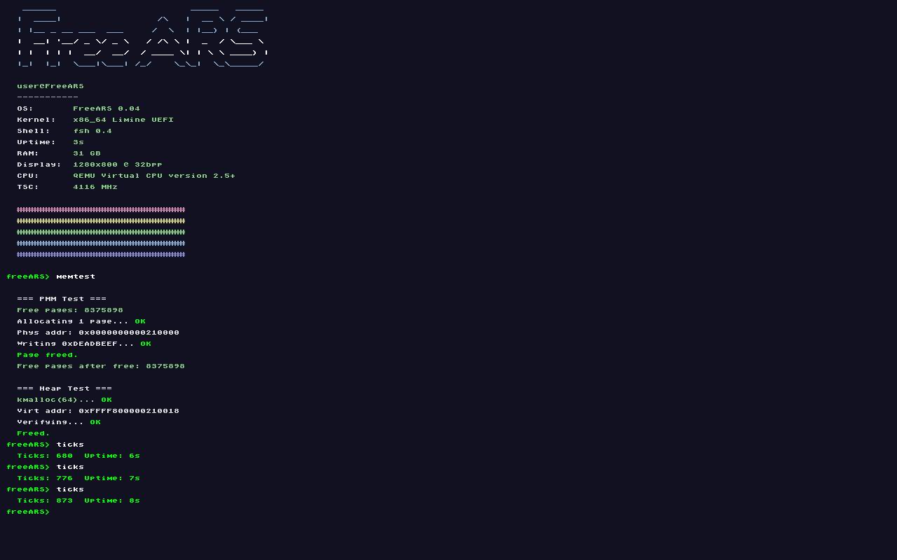

boa — então vamos deixar isso **honesto com o que o código realmente mostra**, sem inflar PMM/heap como novidade de 0.06.

Aqui vai o README corrigido:

---

# FreeARS - Another Random System

> *"I'm doing a (free) operating system (just a hobby, won't be big and professional like linux)"*
> — inspired by Linus Torvalds, 1991

FreeARS is a hobby x86_64 kernel written from scratch.
UEFI boot via Limine, framebuffer output, and a growing low-level system layer.

**Current version:** 0.06
**Branch:** `x86_64-uefi` (active development)

---

## Screenshots

*28/04/26 — IT BOOTED!!! 64-bit mode (QEMU) after hours of bugs!*  
*30/04/26 — Booted on a baremetal-like VM (VirtualBox)!*  
*31/04/26 — UEFI + Limine + TSC working!!!*  
*31/04/26 — Bare metal on real hardware working! Posted on my tiktok. @theloneahlan*  
*01/05/26 — PMM + heap working! Tested up to 32GB RAM.*
*01/05/26 — Shell + ATA disk detection added, ill post on my tiktok!!*

### Boot + shell (VirtualBox)

---

## What's new in 0.06

* **Interactive shell (fsh)** with command parsing
* **ATA disk detection (`lsblk`)**
* Improved command system structure
* Basic system info commands (`uname`, `ticks`, `fastfetch`)
* Exception handling improvements
* Keyboard-driven terminal input
* Cursor rendering callback integration

---

## Features

* UEFI boot via Limine
* x86_64 long mode kernel
* Framebuffer terminal (bitmap font)
* PS/2 keyboard input (line-based shell)
* TSC-based timing system (calibrated via PIT)
* CPUID CPU detection
* RAM detection (Limine memmap)
* IDT + basic exception handling
* Serial debug output (QEMU support)

---

## Shell commands

| Command       | Description              |
| ------------- | ------------------------ |
| `help`        | Show available commands  |
| `clear`       | Clear screen             |
| `uname`       | Kernel version info      |
| `echo <text>` | Print text               |
| `sleep <ms>`  | Busy-wait delay (TSC)    |
| `ticks`       | Uptime counter           |
| `fastfetch`   | System overview          |
| `lsblk`       | List ATA drives          |
| `crash`       | Trigger exception (test) |
| `reboot`      | Reboot system            |

---

## Storage (0.06)

* ATA detection implemented (`lsblk`)
* Drive enumeration (`sda`, `sdb`, ...)
* Model + size display
* No filesystem mounted yet (FAT32 disabled in code, so many bugs)

---

## Bootloader history

| Version   | Bootloader | Mode |
| --------- | ---------- | ---- |
| 0.01–0.03 | GRUB       | BIOS |
| 0.04–0.06 | Limine     | UEFI |

---

## Version history

| Version  | Description                                                  |
| -------- | ------------------------------------------------------------ |
| 0.01     | 32-bit VESA kernel                                           |
| 0.02     | 64-bit early shell                                           |
| 0.03     | framebuffer + CPUID                                          |
| 0.04     | UEFI + Limine + TSC                                          |
| 0.05     | basic system improvements                                    |
| **0.06** | **shell + ATA disk detection + command system improvements** |

---

## Next steps (0.07)

* [ ] Virtual memory manager (paging)
* [ ] FULL FAT32 filesystem support
* [ ] APIC timer (replace TSC sleep)
* [ ] Scheduler (basic multitasking)
* [ ] Syscalls
* [ ] User mode (ring 3)

---

## Notes

* FAT32 driver exists in codebase but is currently disabled / won't work
* `lsblk` is the only active storage feature
* System is still fully kernel-mode only
* Designed purely for learning OS development

---

## License

Do whatever you want. It's a hobby.
